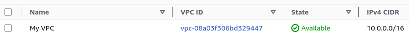
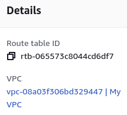
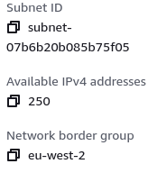
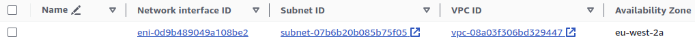

# Terraform Apache Server

An EC2 instance with Apache installed deployed with Terraform.

## _Steps:_

1. Create a VPC.
   
2. Create an Internet Gateway.
   
3. Create a custome Route Table.
   
4. Create a Subnet.
   
5. Associate the Subnet with a Route Table.
6. Create a Security Group to allow port 22, 80 and 443.
   
7. Create a Network Interface with an IP in the Subnet that was created in step 4.
8. Assign an Elastic IP to the Network Interface that was created in step 7.
   
9. Create an Ubuntu server and install/enable apache2.
